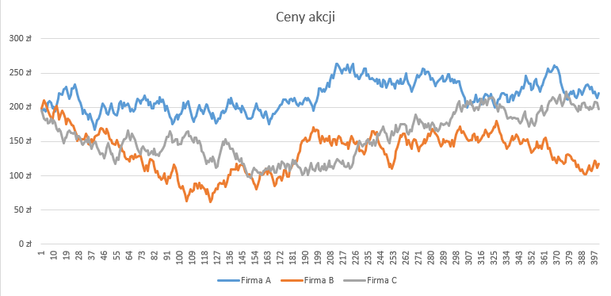

## Zadanie 5 - Giełda // podstawa, maj 2012
https://arkusze.pl/matura-informatyka-2012-maj-poziom-podstawowy/
###### wykonane dnia 28.09.2025

### Odpowiedzi:

#### Podpunkt a)
```
Firma A Firma B Firma C
221 zł	117 zł	198 zł
```

#### Podpunkt b)
```
        Maximum     Minimum
Firma A 264 zł      167 zł
Firma B 210 zł      62 zł
Firma C 223 zł      97 zł
```

#### Podpunkt c)


#### Podpunkt d)
```
6 krachów giełdowych
Ostatni:
Firma A: 224 zł
Firma B: 163 zł
Firma C: 194 zł
```

#### Podpunkt e)
```
14 razy
```