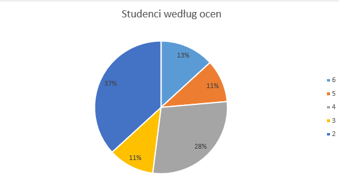

## Zadanie 6 - Wyniki // podstawa, czerwiec 2020
https://arkusze.pl/matura-stara-informatyka-2020-czerwiec-poziom-podstawowy/
###### wykonane dnia 28.09.2025

### Odpowiedzi:

#### 6.1
```
Grupa	Studentów
A	28
B	30
C	31
D	33
E	37
F	32
G	31
H	28
```

#### 6.2
```
77 punktów (9)
```

#### 6.3
```
Ocena	Studentów
2	92
3	26
4	71
5	26
6	33
```
