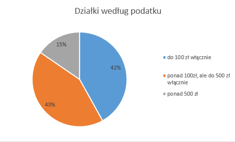

## Zadanie 4 - Działki // podstawa, maj 2014
https://arkusze.pl/matura-informatyka-2014-maj-poziom-podstawowy/
###### wykonane dnia 28.09.2025

### Odpowiedzi:

#### Podpunkt a)
```
Największa - 551/54 - 1500 - X
Najmniejsza - 518/51 - 500,18 - S
```

#### Podpunkt b)
```
Typ     Ilość   Średnia m2
B	1775	999,59
L	559	1016,75
R	708	989,98
S	964	986,12
X	994	989,94

```

#### Podpunkt c)
```
do 100 zł włącznie	2096
ponad 100zł, ale do 500 zł włącznie	2133
ponad 500 zł	771
```

