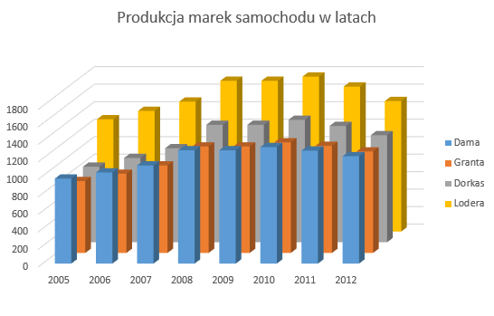

## Zadanie 4 - Fabryka samochodów // podstawa, maj 2015
https://arkusze.pl/matura-stara-informatyka-2015-maj-poziom-podstawowy/
###### wykonane dnia 29.09.2025

### Odpowiedzi:

#### 4.1
```
Dama	Granta	Dorkas	Lodera
317	300	322	398
```

#### 4.2
```
Lodera 310 II kwartał 2014
```

#### 4.3
```
Dama	Granta	Dorkas	Lodera
18	9	17	32
```

#### 4.4
```
29368
```

#### 4.5
